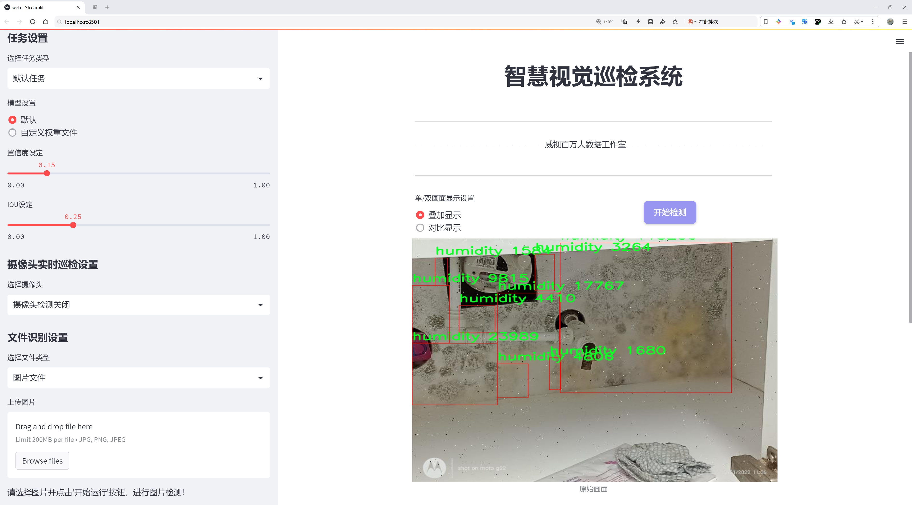
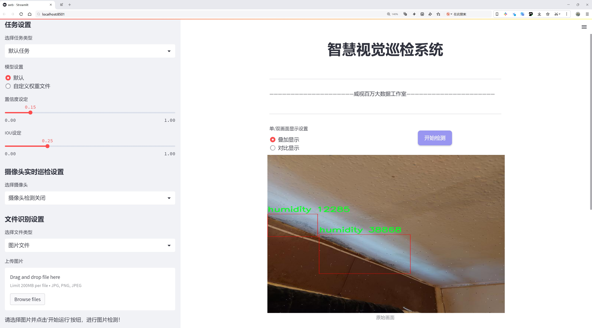
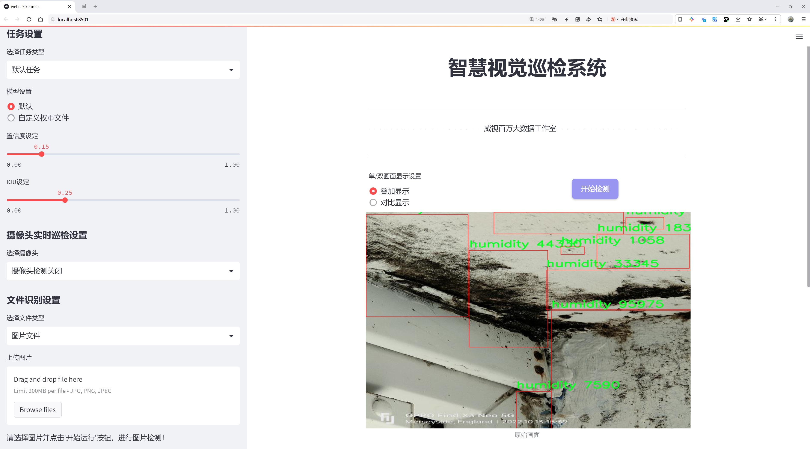
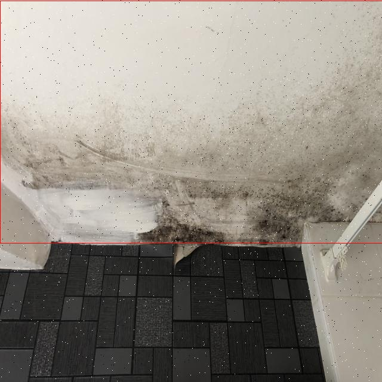
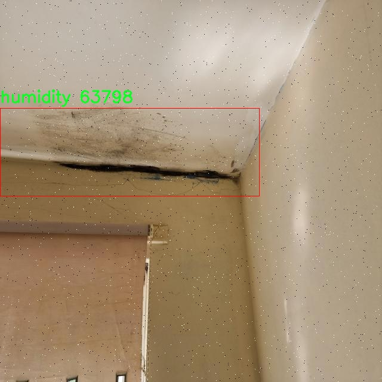
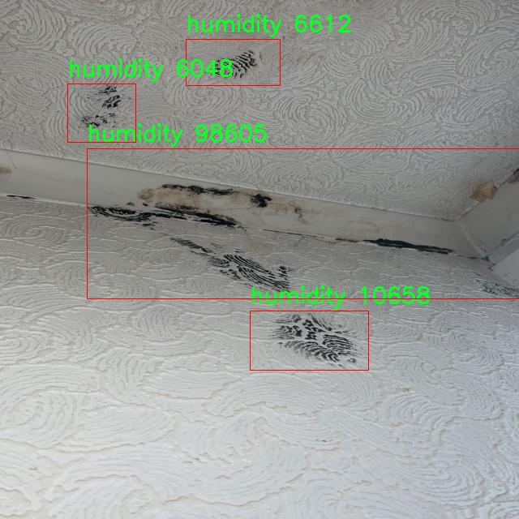
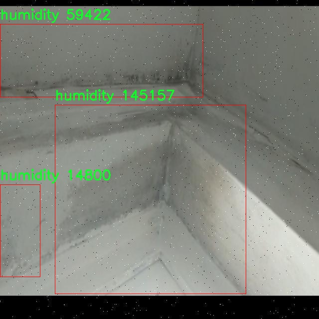

# 房屋受潮湿度检测检测系统源码分享
 # [一条龙教学YOLOV8标注好的数据集一键训练_70+全套改进创新点发刊_Web前端展示]

### 1.研究背景与意义

项目参考[AAAI Association for the Advancement of Artificial Intelligence](https://gitee.com/qunmasj/projects)

项目来源[AACV Association for the Advancement of Computer Vision](https://kdocs.cn/l/cszuIiCKVNis)

研究背景与意义

随着全球气候变化的加剧，湿度对建筑物的影响日益显著，尤其是在潮湿地区，房屋受潮问题不仅影响居住舒适度，还可能导致结构损坏、霉菌滋生及健康隐患。因此，开发一种高效、准确的房屋受潮湿度检测系统显得尤为重要。传统的湿度检测方法多依赖于人工巡检和传统仪器，存在效率低、成本高和主观性强等缺陷。近年来，计算机视觉和深度学习技术的迅猛发展为这一问题提供了新的解决思路。

YOLO（You Only Look Once）系列模型以其快速的检测速度和较高的准确率，成为目标检测领域的热门选择。YOLOv8作为该系列的最新版本，进一步提升了模型的性能和应用范围。通过对YOLOv8的改进，我们可以更好地适应房屋受潮湿度检测的需求，尤其是在复杂环境下的实时监测能力。基于YOLOv8的房屋受潮湿度检测系统，能够自动识别和定位受潮区域，为后续的处理和修复提供科学依据。

本研究所使用的数据集包含7900张图像，涵盖了湿度检测的多种场景。这些图像经过精心标注，确保了模型训练的有效性和准确性。数据集中仅包含一个类别——湿度，这一简化的分类设置有助于模型专注于特定的检测任务，提高检测精度。通过对这些数据的深入分析与处理，我们能够提取出湿度相关的特征信息，从而为模型的训练提供强有力的支持。

在实际应用中，房屋受潮湿度检测系统的推广将极大地提高建筑物维护的效率，降低因潮湿导致的经济损失。通过实时监测和预警，用户可以及时采取措施，防止潮湿问题的进一步恶化。此外，该系统的实施还将为建筑行业提供数据支持，推动相关技术的进步与创新。

综上所述，基于改进YOLOv8的房屋受潮湿度检测系统不仅具有重要的学术价值，也具有广泛的应用前景。通过将深度学习技术与建筑物维护相结合，我们可以有效提升湿度检测的智能化水平，为构建更加安全、舒适的居住环境贡献力量。未来的研究将进一步探索模型的优化与应用场景的拓展，以期实现更高效的房屋湿度管理解决方案。

### 2.图片演示







##### 注意：由于此博客编辑较早，上面“2.图片演示”和“3.视频演示”展示的系统图片或者视频可能为老版本，新版本在老版本的基础上升级如下：（实际效果以升级的新版本为准）

  （1）适配了YOLOV8的“目标检测”模型和“实例分割”模型，通过加载相应的权重（.pt）文件即可自适应加载模型。

  （2）支持“图片识别”、“视频识别”、“摄像头实时识别”三种识别模式。

  （3）支持“图片识别”、“视频识别”、“摄像头实时识别”三种识别结果保存导出，解决手动导出（容易卡顿出现爆内存）存在的问题，识别完自动保存结果并导出到tempDir中。

  （4）支持Web前端系统中的标题、背景图等自定义修改，后面提供修改教程。

  另外本项目提供训练的数据集和训练教程,暂不提供权重文件（best.pt）,需要您按照教程进行训练后实现图片演示和Web前端界面演示的效果。

### 3.视频演示

[3.1 视频演示](https://www.bilibili.com/video/BV1HzxjerEp4/)

### 4.数据集信息展示

##### 4.1 本项目数据集详细数据（类别数＆类别名）

nc: 1
names: ['humidity']


##### 4.2 本项目数据集信息介绍

数据集信息展示

在本研究中，我们采用了名为“ttest1234”的数据集，以支持对房屋受潮湿度检测系统的训练，旨在改进YOLOv8模型的性能。该数据集专注于湿度检测，具有单一类别，具体为“humidity”。这一设计使得数据集在处理湿度相关问题时具有高度的针对性和有效性。

“ttest1234”数据集的构建考虑到了房屋环境中湿度变化的多样性和复杂性。数据集中包含了多种不同场景下的湿度图像，这些图像不仅展示了不同房屋结构的内部环境，还涵盖了多种气候条件下的湿度表现。通过这些丰富的样本，模型能够学习到湿度在不同环境下的特征，从而提高其检测的准确性和鲁棒性。

在数据集的采集过程中，我们采用了多种先进的成像技术，以确保所获取图像的质量和多样性。图像的拍摄时间、地点、光照条件等因素均被精心控制，以模拟真实世界中湿度变化的多样性。此外，数据集中还包含了标注信息，明确指出了每张图像中湿度的具体情况。这些标注不仅为模型提供了训练所需的真实标签，也为后续的模型评估和性能分析提供了重要依据。

为了进一步增强数据集的实用性，我们在“ttest1234”中引入了数据增强技术。这些技术包括图像旋转、缩放、翻转及亮度调整等，旨在扩展数据集的规模和多样性，从而提高模型的泛化能力。通过这种方式，我们能够在有限的样本量下，模拟出更多的湿度变化场景，进而提升模型在实际应用中的表现。

在训练过程中，YOLOv8模型将利用“ttest1234”数据集进行深度学习，识别和分类图像中的湿度特征。该模型的结构设计使其能够高效地处理图像数据，快速提取出与湿度相关的特征信息。通过不断迭代训练，模型将逐步优化其参数，以实现更高的检测精度和更快的响应速度。

此外，数据集的单一类别设计使得模型的训练过程更加集中，避免了多类别之间的干扰，从而使得湿度检测的任务更加明确和高效。这种专注于单一类别的策略，尤其适用于特定领域的应用，如房屋维护、环境监测等，能够为相关行业提供更为精准的湿度检测解决方案。

综上所述，“ttest1234”数据集为本研究提供了坚实的基础，通过其丰富的样本和高质量的标注信息，支持了YOLOv8模型在房屋受潮湿度检测任务中的训练与优化。随着研究的深入，我们期待这一数据集能够为湿度检测技术的发展贡献力量，并推动相关领域的应用创新。










### 5.全套项目环境部署视频教程（零基础手把手教学）

[5.1 环境部署教程链接（零基础手把手教学）](https://www.ixigua.com/7404473917358506534?logTag=c807d0cbc21c0ef59de5)


[5.2 安装Python虚拟环境创建和依赖库安装视频教程链接（零基础手把手教学）](https://www.ixigua.com/7404474678003106304?logTag=1f1041108cd1f708b01a)

### 6.手把手YOLOV8训练视频教程（零基础小白有手就能学会）

[6.1 手把手YOLOV8训练视频教程（零基础小白有手就能学会）](https://www.ixigua.com/7404477157818401292?logTag=d31a2dfd1983c9668658)

### 7.70+种全套YOLOV8创新点代码加载调参视频教程（一键加载写好的改进模型的配置文件）

[7.1 70+种全套YOLOV8创新点代码加载调参视频教程（一键加载写好的改进模型的配置文件）](https://www.ixigua.com/7404478314661806627?logTag=29066f8288e3f4eea3a4)

### 8.70+种全套YOLOV8创新点原理讲解（非科班也可以轻松写刊发刊，V10版本正在科研待更新）

由于篇幅限制，每个创新点的具体原理讲解就不一一展开，具体见下列网址中的创新点对应子项目的技术原理博客网址【Blog】：


[8.1 70+种全套YOLOV8创新点原理讲解链接](https://gitee.com/qunmasj/good)

### 9.系统功能展示（检测对象为举例，实际内容以本项目数据集为准）

图9.1.系统支持检测结果表格显示

  图9.2.系统支持置信度和IOU阈值手动调节

  图9.3.系统支持自定义加载权重文件best.pt(需要你通过步骤5中训练获得)

  图9.4.系统支持摄像头实时识别

  图9.5.系统支持图片识别

  图9.6.系统支持视频识别

  图9.7.系统支持识别结果文件自动保存

  图9.8.系统支持Excel导出检测结果数据


### 10.原始YOLOV8算法原理

原始YOLOv8算法原理

YOLOv8算法是由Ultralytics公司于2023年推出的目标检测领域的最新进展，作为YOLO系列的基本模型之一，它在原有YOLO系列的基础上进行了多项重要的改进和创新。YOLOv8的设计理念是为了在保证高精度的同时，提高检测速度，尤其是在复杂场景下的目标检测能力。其核心架构分为三个主要部分：Backbone、Neck和Head，这些部分的精心设计使得YOLOv8在特征提取、特征融合和目标检测方面表现出色。

在Backbone部分，YOLOv8采用了一系列卷积和反卷积层，结合残差连接和瓶颈结构，旨在提取输入图像的丰富特征。该部分的基本构成单元是C2模块，设计上不仅提升了特征提取的效率，还通过5个CBS模块、4个C2f模块和1个快速空间金字塔池化(SPPF)模块的组合，增强了模型的表现力。C2f模块的引入，替代了YOLOv5中的C3模块，使得特征提取过程更加灵活和高效。SPPF模块的使用则显著提高了模型的计算速度，确保在处理高分辨率图像时依然能够保持实时性。

接下来是Neck部分，它的设计旨在实现多尺度特征的融合，以便更好地捕捉不同尺寸目标的信息。YOLOv8采用了PAN-FPN（Path Aggregation Network - Feature Pyramid Network）结构，通过上采样和下采样的方式，将来自Backbone不同阶段的特征图进行有效融合。这种多尺度特征融合技术不仅提升了目标检测的性能，还增强了模型在复杂环境下的鲁棒性，确保了即使在目标尺寸变化较大的情况下，模型依然能够准确识别和定位目标。

最后是Head部分，它负责最终的目标检测和分类任务。YOLOv8的Head设计了三个检测头，专门用于在不同尺寸的信息下进行目标检测。每个检测头都包含一系列卷积层和反卷积层，利用解耦头结构来生成检测结果。与传统的anchor-based检测方法不同，YOLOv8采用了anchor-free的检测方式，这种创新的设计不仅提高了检测精度，还加快了检测速度，尤其在处理小目标时表现尤为突出。

YOLOv8的训练和部署框架也得到了显著的改进，新的Pytorch训练框架使得自定义模型的训练变得更加方便，用户可以根据具体需求进行灵活调整。这种灵活性为研究人员和开发者提供了更多的可能性，使得YOLOv8不仅适用于通用目标检测任务，还能够根据特定应用场景进行定制化优化。

尽管YOLOv8在许多方面都取得了显著的进步，但在某些复杂环境下，尤其是水面等背景复杂的场景中，仍然存在一些挑战。例如，小目标漂浮物的特征复杂且背景多样，可能导致定位误差和对目标感知能力不足的问题。为了解决这些问题，研究者们提出了针对YOLOv8的改进方案，如YOLOv8-WSSOD算法，通过引入BiFormer双层路由注意力机制和更小的检测头，提升了网络对小目标的感知能力，同时在Neck端引入GSConv和Slim-neck技术，进一步提高了模型的精度并降低了计算量。

总的来说，YOLOv8算法通过其创新的网络结构和灵活的训练框架，为目标检测领域带来了新的活力。其在特征提取、特征融合和目标检测方面的优势，使得YOLOv8成为当前目标检测任务中的一个重要工具。随着技术的不断进步，YOLOv8及其衍生算法将继续推动目标检测技术的发展，为更广泛的应用场景提供支持。


### 11.项目核心源码讲解（再也不用担心看不懂代码逻辑）

#### 11.1 ui.py

以下是经过精简和注释的核心代码：

```python
import sys
import subprocess

def run_script(script_path):
    """
    使用当前 Python 环境运行指定的脚本。

    Args:
        script_path (str): 要运行的脚本路径
    """
    # 获取当前 Python 解释器的路径
    python_path = sys.executable

    # 构建运行命令，使用 streamlit 运行指定的脚本
    command = f'"{python_path}" -m streamlit run "{script_path}"'

    # 执行命令并捕获结果
    result = subprocess.run(command, shell=True)
    
    # 检查命令执行结果，如果返回码不为0，表示出错
    if result.returncode != 0:
        print("脚本运行出错。")

# 主程序入口
if __name__ == "__main__":
    # 指定要运行的脚本路径
    script_path = "web.py"  # 假设脚本在当前目录下

    # 调用函数运行脚本
    run_script(script_path)
```

### 代码注释说明：
1. **导入模块**：
   - `sys`：用于获取当前 Python 解释器的路径。
   - `subprocess`：用于执行外部命令。

2. **`run_script` 函数**：
   - 接受一个参数 `script_path`，表示要运行的 Python 脚本的路径。
   - 使用 `sys.executable` 获取当前 Python 解释器的路径。
   - 构建一个命令字符串，使用 `streamlit` 模块运行指定的脚本。
   - 使用 `subprocess.run` 执行命令，并捕获执行结果。
   - 检查返回码，如果不为0，打印错误信息。

3. **主程序入口**：
   - 当脚本作为主程序运行时，指定要运行的脚本路径（此处假设为 `web.py`）。
   - 调用 `run_script` 函数来执行该脚本。

这个文件名为 `ui.py`，其主要功能是通过当前的 Python 环境来运行一个指定的脚本，具体来说是一个名为 `web.py` 的脚本。文件中首先导入了必要的模块，包括 `sys`、`os` 和 `subprocess`，以及一个自定义的函数 `abs_path`，该函数用于获取文件的绝对路径。

在 `run_script` 函数中，首先获取当前 Python 解释器的路径，使用 `sys.executable`。接着，构建一个命令字符串，这个命令会调用 `streamlit` 来运行指定的脚本。`streamlit` 是一个用于构建数据应用的框架，通常用于快速开发和展示数据可视化应用。

随后，使用 `subprocess.run` 方法来执行这个命令。这个方法会在一个新的进程中运行命令，并等待其完成。如果脚本运行的返回码不为零，表示运行过程中出现了错误，此时会打印出“脚本运行出错”的提示信息。

在文件的最后部分，使用 `if __name__ == "__main__":` 语句来确保只有在直接运行这个文件时才会执行后面的代码。在这里，首先调用 `abs_path` 函数来获取 `web.py` 的绝对路径，然后调用 `run_script` 函数来运行这个脚本。

总体来说，这个文件的作用是作为一个启动器，通过调用 `streamlit` 来运行一个数据应用脚本 `web.py`，并处理可能出现的错误。

#### 11.2 70+种YOLOv8算法改进源码大全和调试加载训练教程（非必要）\ultralytics\models\sam\predict.py

以下是代码中最核心的部分，并附上详细的中文注释：

```python
class Predictor(BasePredictor):
    """
    Predictor类用于Segment Anything Model (SAM)，继承自BasePredictor。

    该类提供了一个接口，用于针对图像分割任务进行模型推理。
    通过先进的架构和可提示的分割能力，它支持灵活和实时的掩膜生成。
    该类能够处理多种类型的提示，如边界框、点和低分辨率掩膜。
    """

    def __init__(self, cfg=DEFAULT_CFG, overrides=None, _callbacks=None):
        """
        初始化Predictor，设置配置、覆盖和回调。

        Args:
            cfg (dict): 配置字典。
            overrides (dict, optional): 覆盖默认配置的值字典。
            _callbacks (dict, optional): 自定义行为的回调函数字典。
        """
        if overrides is None:
            overrides = {}
        overrides.update(dict(task='segment', mode='predict', imgsz=1024))
        super().__init__(cfg, overrides, _callbacks)
        self.args.retina_masks = True  # 启用高分辨率掩膜
        self.im = None  # 输入图像
        self.features = None  # 提取的图像特征
        self.prompts = {}  # 存储各种提示类型
        self.segment_all = False  # 控制是否分割所有对象的标志

    def preprocess(self, im):
        """
        对输入图像进行预处理，以便模型推理。

        Args:
            im (torch.Tensor | List[np.ndarray]): BCHW格式的张量或HWC格式的numpy数组列表。

        Returns:
            (torch.Tensor): 预处理后的图像张量。
        """
        if self.im is not None:
            return self.im  # 如果已经处理过，直接返回
        not_tensor = not isinstance(im, torch.Tensor)
        if not_tensor:
            im = np.stack(self.pre_transform(im))  # 预转换
            im = im[..., ::-1].transpose((0, 3, 1, 2))  # 转换为BCHW格式
            im = np.ascontiguousarray(im)
            im = torch.from_numpy(im)

        im = im.to(self.device)  # 移动到设备
        im = im.half() if self.model.fp16 else im.float()  # 根据模型设置选择数据类型
        if not_tensor:
            im = (im - self.mean) / self.std  # 归一化
        return im

    def inference(self, im, bboxes=None, points=None, labels=None, masks=None, multimask_output=False, *args, **kwargs):
        """
        基于给定的输入提示执行图像分割推理。

        Args:
            im (torch.Tensor): 预处理后的输入图像张量，形状为(N, C, H, W)。
            bboxes (np.ndarray | List, optional): 边界框，形状为(N, 4)，XYXY格式。
            points (np.ndarray | List, optional): 指示对象位置的点，形状为(N, 2)，像素坐标。
            labels (np.ndarray | List, optional): 点提示的标签，形状为(N, )。1表示前景，0表示背景。
            masks (np.ndarray, optional): 先前预测的低分辨率掩膜，形状应为(N, H, W)，对于SAM，H=W=256。
            multimask_output (bool, optional): 返回多个掩膜的标志，适用于模糊提示。默认为False。

        Returns:
            (tuple): 包含以下三个元素的元组。
                - np.ndarray: 输出掩膜，形状为CxHxW，其中C是生成的掩膜数量。
                - np.ndarray: 长度为C的数组，包含模型为每个掩膜预测的质量分数。
                - np.ndarray: 形状为CxHxW的低分辨率logits，用于后续推理，H=W=256。
        """
        # 如果self.prompts中存储了提示，则覆盖
        bboxes = self.prompts.pop('bboxes', bboxes)
        points = self.prompts.pop('points', points)
        masks = self.prompts.pop('masks', masks)

        if all(i is None for i in [bboxes, points, masks]):
            return self.generate(im, *args, **kwargs)  # 如果没有提示，生成掩膜

        return self.prompt_inference(im, bboxes, points, labels, masks, multimask_output)  # 使用提示进行推理

    def generate(self, im, crop_n_layers=0, crop_overlap_ratio=512 / 1500, crop_downscale_factor=1,
                 points_stride=32, points_batch_size=64, conf_thres=0.88, stability_score_thresh=0.95,
                 stability_score_offset=0.95, crop_nms_thresh=0.7):
        """
        使用Segment Anything Model (SAM)执行图像分割。

        Args:
            im (torch.Tensor): 输入张量，表示预处理后的图像，维度为(N, C, H, W)。
            crop_n_layers (int): 指定用于图像裁剪的层数。
            crop_overlap_ratio (float): 裁剪之间的重叠比例。
            points_stride (int, optional): 每侧采样的点数。
            points_batch_size (int): 同时处理的点的批量大小。
            conf_thres (float): 根据模型的掩膜质量预测进行过滤的置信度阈值。
            stability_score_thresh (float): 基于掩膜稳定性进行过滤的稳定性阈值。
            crop_nms_thresh (float): 用于去除裁剪之间重复掩膜的非最大抑制（NMS）阈值。

        Returns:
            (tuple): 包含分割掩膜、置信度分数和边界框的元组。
        """
        self.segment_all = True  # 设置为分割所有对象
        ih, iw = im.shape[2:]  # 获取输入图像的高度和宽度
        crop_regions, layer_idxs = generate_crop_boxes((ih, iw), crop_n_layers, crop_overlap_ratio)  # 生成裁剪区域
        pred_masks, pred_scores, pred_bboxes, region_areas = [], [], [], []  # 初始化结果列表

        for crop_region, layer_idx in zip(crop_regions, layer_idxs):
            x1, y1, x2, y2 = crop_region  # 裁剪区域的坐标
            w, h = x2 - x1, y2 - y1  # 裁剪区域的宽度和高度
            area = torch.tensor(w * h, device=im.device)  # 计算裁剪区域的面积
            crop_im = F.interpolate(im[..., y1:y2, x1:x2], (ih, iw), mode='bilinear', align_corners=False)  # 裁剪并插值

            # 在此区域内进行推理
            crop_masks, crop_scores, crop_bboxes = [], [], []
            for (points, ) in batch_iterator(points_batch_size, points_for_image):
                pred_mask, pred_score = self.prompt_inference(crop_im, points=points, multimask_output=True)  # 进行推理
                # 对预测的掩膜进行插值
                pred_mask = F.interpolate(pred_mask[None], (h, w), mode='bilinear', align_corners=False)[0]
                idx = pred_score > conf_thres  # 根据置信度阈值过滤掩膜
                pred_mask, pred_score = pred_mask[idx], pred_score[idx]

                # 计算稳定性分数并进行过滤
                stability_score = calculate_stability_score(pred_mask, self.model.mask_threshold, stability_score_offset)
                idx = stability_score > stability_score_thresh
                pred_mask, pred_score = pred_mask[idx], pred_score[idx]

                crop_masks.append(pred_mask)  # 保存掩膜
                crop_bboxes.append(pred_bbox)  # 保存边界框
                crop_scores.append(pred_score)  # 保存分数

            # 在裁剪区域内进行NMS
            crop_masks = torch.cat(crop_masks)
            crop_bboxes = torch.cat(crop_bboxes)
            crop_scores = torch.cat(crop_scores)
            keep = torchvision.ops.nms(crop_bboxes, crop_scores, self.args.iou)  # NMS
            pred_masks.append(crop_masks[keep])  # 保存最终掩膜
            pred_bboxes.append(crop_bboxes[keep])  # 保存最终边界框
            pred_scores.append(crop_scores[keep])  # 保存最终分数
            region_areas.append(area.expand(len(crop_masks)))  # 保存区域面积

        # 合并所有结果
        pred_masks = torch.cat(pred_masks)
        pred_bboxes = torch.cat(pred_bboxes)
        pred_scores = torch.cat(pred_scores)

        return pred_masks, pred_scores, pred_bboxes  # 返回最终结果
```

### 主要功能说明
1. **初始化和配置**：`__init__` 方法用于初始化预测器，包括设置默认配置和处理图像的相关参数。
2. **图像预处理**：`preprocess` 方法负责将输入图像转换为模型可以接受的格式，并进行归一化处理。
3. **推理过程**：`inference` 方法根据给定的提示（如边界框、点等）执行图像分割推理。
4. **生成掩膜**：`generate` 方法使用SAM模型对整个图像进行分割，并支持裁剪处理以提高分割精度。
5. **后处理**：对模型输出的掩膜和边界框进行后处理，以便于后续使用。

以上是代码的核心部分及其详细注释，涵盖了图像分割的主要流程和功能。

这个程序文件是一个用于实现图像分割的预测模块，基于Segment Anything Model（SAM），并且是Ultralytics框架的一部分。该模块提供了高性能、实时的图像分割功能，支持多种输入提示（如边界框、点和低分辨率掩码），使得用户能够灵活地进行图像分割任务。

文件首先导入了一些必要的库，包括NumPy、PyTorch和TorchVision等。接着定义了一个`Predictor`类，继承自`BasePredictor`，该类主要负责模型推理。构造函数中，初始化了一些属性，包括配置字典、覆盖的参数、回调函数等，并设置了一些特定于任务的参数，如启用retina_masks。

`preprocess`方法用于对输入图像进行预处理，包括转换为张量格式、归一化等。`pre_transform`方法则对输入图像进行初步变换，如调整大小。`inference`方法是进行图像分割推理的核心，支持多种输入提示，若没有提供提示，则调用`generate`方法进行全图分割。

`generate`方法实现了对整个图像的分割，支持对图像进行裁剪处理，以便进行更精细的分割。它会生成多个图像裁剪区域，并在每个区域内进行推理，最后合并结果并进行非极大值抑制（NMS）以去除重复的掩码。

`setup_model`方法用于初始化SAM模型，分配设备并设置图像归一化参数。`postprocess`方法则对模型的输出进行后处理，生成最终的分割掩码和边界框，并将其缩放回原始图像大小。

此外，`set_image`方法用于设置单张图像进行推理，`set_prompts`方法用于提前设置提示信息，`reset_image`方法则重置图像和特征。`remove_small_regions`方法用于后处理生成的掩码，去除小的、不连通的区域，并执行NMS以消除重复的边界框。

总体而言，这个文件实现了一个功能强大的图像分割预测器，能够处理多种输入格式，并提供高效的推理和后处理功能，适用于实时图像分割任务。

#### 11.3 code\ultralytics\models\yolo\classify\val.py

以下是代码中最核心的部分，并附上详细的中文注释：

```python
import torch
from ultralytics.data import ClassificationDataset, build_dataloader
from ultralytics.engine.validator import BaseValidator
from ultralytics.utils.metrics import ClassifyMetrics, ConfusionMatrix
from ultralytics.utils.plotting import plot_images

class ClassificationValidator(BaseValidator):
    """
    该类扩展了 BaseValidator 类，用于基于分类模型的验证。
    """

    def __init__(self, dataloader=None, save_dir=None, pbar=None, args=None, _callbacks=None):
        """初始化 ClassificationValidator 实例，包含数据加载器、保存目录、进度条和参数。"""
        super().__init__(dataloader, save_dir, pbar, args, _callbacks)
        self.targets = None  # 存储真实标签
        self.pred = None     # 存储模型预测结果
        self.args.task = "classify"  # 设置任务类型为分类
        self.metrics = ClassifyMetrics()  # 初始化分类指标

    def init_metrics(self, model):
        """初始化混淆矩阵、类名以及 top-1 和 top-5 准确率。"""
        self.names = model.names  # 获取模型的类名
        self.nc = len(model.names)  # 类别数量
        self.confusion_matrix = ConfusionMatrix(nc=self.nc, conf=self.args.conf, task="classify")  # 初始化混淆矩阵
        self.pred = []  # 初始化预测结果列表
        self.targets = []  # 初始化真实标签列表

    def preprocess(self, batch):
        """预处理输入批次并返回处理后的批次。"""
        batch["img"] = batch["img"].to(self.device, non_blocking=True)  # 将图像数据移动到设备上
        batch["img"] = batch["img"].half() if self.args.half else batch["img"].float()  # 根据参数选择数据类型
        batch["cls"] = batch["cls"].to(self.device)  # 将标签数据移动到设备上
        return batch

    def update_metrics(self, preds, batch):
        """使用模型预测和批次目标更新运行指标。"""
        n5 = min(len(self.names), 5)  # 取前5个预测
        self.pred.append(preds.argsort(1, descending=True)[:, :n5])  # 按照预测结果排序并取前5
        self.targets.append(batch["cls"])  # 存储真实标签

    def finalize_metrics(self, *args, **kwargs):
        """最终化模型的指标，如混淆矩阵和速度。"""
        self.confusion_matrix.process_cls_preds(self.pred, self.targets)  # 处理预测结果和真实标签
        self.metrics.speed = self.speed  # 记录速度
        self.metrics.confusion_matrix = self.confusion_matrix  # 保存混淆矩阵
        self.metrics.save_dir = self.save_dir  # 保存目录

    def get_stats(self):
        """返回通过处理目标和预测获得的指标字典。"""
        self.metrics.process(self.targets, self.pred)  # 处理真实标签和预测结果
        return self.metrics.results_dict  # 返回结果字典

    def build_dataset(self, img_path):
        """使用给定的图像路径和预处理参数创建并返回 ClassificationDataset 实例。"""
        return ClassificationDataset(root=img_path, args=self.args, augment=False, prefix=self.args.split)

    def get_dataloader(self, dataset_path, batch_size):
        """构建并返回用于分类任务的数据加载器。"""
        dataset = self.build_dataset(dataset_path)  # 创建数据集
        return build_dataloader(dataset, batch_size, self.args.workers, rank=-1)  # 返回数据加载器

    def print_results(self):
        """打印 YOLO 目标检测模型的评估指标。"""
        pf = "%22s" + "%11.3g" * len(self.metrics.keys)  # 打印格式
        LOGGER.info(pf % ("all", self.metrics.top1, self.metrics.top5))  # 打印 top-1 和 top-5 准确率

    def plot_val_samples(self, batch, ni):
        """绘制验证图像样本。"""
        plot_images(
            images=batch["img"],
            batch_idx=torch.arange(len(batch["img"])),  # 批次索引
            cls=batch["cls"].view(-1),  # 类别标签
            fname=self.save_dir / f"val_batch{ni}_labels.jpg",  # 保存文件名
            names=self.names,  # 类别名称
            on_plot=self.on_plot,
        )

    def plot_predictions(self, batch, preds, ni):
        """在输入图像上绘制预测结果并保存结果。"""
        plot_images(
            batch["img"],
            batch_idx=torch.arange(len(batch["img"])),  # 批次索引
            cls=torch.argmax(preds, dim=1),  # 预测类别
            fname=self.save_dir / f"val_batch{ni}_pred.jpg",  # 保存文件名
            names=self.names,  # 类别名称
            on_plot=self.on_plot,
        )
```

### 代码核心部分说明：
1. **初始化方法**：设置模型、数据加载器、保存目录等基本参数。
2. **指标初始化**：为模型的混淆矩阵和准确率等指标进行初始化。
3. **数据预处理**：将输入数据转换为适合模型处理的格式。
4. **指标更新**：在每个批次后更新模型的预测结果和真实标签。
5. **最终化指标**：处理完所有数据后，计算并保存最终的评估指标。
6. **数据集和数据加载器构建**：创建用于分类任务的数据集和数据加载器。
7. **结果打印和可视化**：打印模型的评估结果，并绘制验证样本和预测结果。

这个程序文件 `val.py` 是用于YOLO（You Only Look Once）模型的分类任务验证的实现。它继承自 `BaseValidator` 类，主要负责在给定的数据集上评估分类模型的性能。文件中包含了一些重要的类和方法，下面是对代码的详细说明。

首先，文件导入了必要的库和模块，包括 `torch` 以及一些来自 `ultralytics` 的工具和数据处理模块。`ClassificationValidator` 类是该文件的核心，负责处理分类模型的验证过程。

在 `__init__` 方法中，初始化了验证器的实例，设置了一些基本参数，如数据加载器、保存目录、进度条和其他参数。这里还定义了 `targets` 和 `pred` 变量，用于存储真实标签和模型预测结果。此外，将任务类型设置为“分类”，并初始化了分类指标的实例。

`get_desc` 方法返回一个格式化的字符串，用于总结分类指标，包括类别名称、Top-1 准确率和 Top-5 准确率。

`init_metrics` 方法用于初始化混淆矩阵、类别名称和准确率。它从模型中获取类别名称，并创建一个混淆矩阵实例，以便后续的性能评估。

`preprocess` 方法负责对输入批次进行预处理，将图像和标签移动到指定的设备上，并根据需要转换数据类型（如半精度或单精度）。

`update_metrics` 方法在每个批次处理后更新运行中的指标，它将模型的预测结果和真实标签存储到 `pred` 和 `targets` 列表中。

`finalize_metrics` 方法用于最终化模型的指标，包括处理混淆矩阵和计算速度。如果启用了绘图选项，它还会生成混淆矩阵的可视化图。

`get_stats` 方法返回一个字典，包含通过处理真实标签和预测结果得到的各种指标。

`build_dataset` 方法根据给定的图像路径和预处理参数创建并返回一个 `ClassificationDataset` 实例。

`get_dataloader` 方法则是构建并返回一个数据加载器，用于分类任务。

`print_results` 方法用于打印YOLO模型的评估指标，格式化输出所有类别的Top-1和Top-5准确率。

`plot_val_samples` 和 `plot_predictions` 方法用于绘制验证图像样本和模型预测结果，并将其保存为图像文件。这些方法利用 `plot_images` 函数将图像和标签或预测结果可视化。

总的来说，这个文件实现了YOLO模型在分类任务中的验证流程，包括数据预处理、指标计算、结果打印和可视化等功能，为模型的性能评估提供了全面的支持。

#### 11.4 code\ultralytics\models\nas\__init__.py

以下是经过简化并添加详细中文注释的核心代码部分：

```python
# 导入Ultralytics YOLO库，遵循AGPL-3.0许可证

# 从当前模块导入NAS模型
from .model import NAS

# 从当前模块导入NAS预测器
from .predict import NASPredictor

# 从当前模块导入NAS验证器
from .val import NASValidator

# 定义模块的公共接口，允许外部访问NAS预测器、验证器和模型
__all__ = "NASPredictor", "NASValidator", "NAS"
```

### 代码详细注释说明：

1. **导入模块**：
   - `from .model import NAS`：从当前包的`model`模块中导入`NAS`类，`NAS`是一个模型类，可能用于构建和训练神经网络。
   - `from .predict import NASPredictor`：从当前包的`predict`模块中导入`NASPredictor`类，`NASPredictor`可能用于对输入数据进行预测。
   - `from .val import NASValidator`：从当前包的`val`模块中导入`NASValidator`类，`NASValidator`可能用于验证模型的性能。

2. **定义公共接口**：
   - `__all__ = "NASPredictor", "NASValidator", "NAS"`：定义了一个公共接口`__all__`，它指定了当使用`from module import *`语句时，哪些名称会被导入。这里允许外部访问`NASPredictor`、`NASValidator`和`NAS`这三个类。

这个程序文件是Ultralytics YOLO项目中的一个初始化文件，通常用于定义模块的公共接口。文件的开头包含了一条注释，表明该项目是Ultralytics YOLO，并且使用AGPL-3.0许可证。

接下来，文件通过相对导入的方式引入了三个组件：`NAS`、`NASPredictor`和`NASValidator`。这些组件分别来自于同一目录下的不同模块。`NAS`可能是一个模型类，负责定义和构建神经网络架构；`NASPredictor`则可能是一个用于进行预测的类，负责处理输入数据并生成模型的输出；而`NASValidator`则可能用于模型的验证过程，评估模型在验证集上的表现。

最后，`__all__`变量被定义为一个元组，包含了这三个组件的名称。这意味着当使用`from module import *`语句时，只会导入这三个指定的组件，而不会导入其他未列出的内容。这种做法有助于控制模块的公共接口，避免不必要的名称冲突或误用。

总的来说，这个文件的主要作用是组织和导出与NAS（神经架构搜索）相关的模型和功能，方便其他模块或用户进行调用和使用。

#### 11.5 70+种YOLOv8算法改进源码大全和调试加载训练教程（非必要）\ultralytics\trackers\utils\gmc.py

以下是经过简化并添加详细中文注释的核心代码部分：

```python
import cv2
import numpy as np
from ultralytics.utils import LOGGER

class GMC:
    """
    通用运动补偿 (GMC) 类，用于视频帧中的跟踪和目标检测。
    该类提供基于多种跟踪算法（包括 ORB、SIFT、ECC 和稀疏光流）的对象跟踪和检测方法。
    """

    def __init__(self, method='sparseOptFlow', downscale=2):
        """初始化 GMC 对象，设置跟踪方法和缩放因子。"""
        self.method = method  # 跟踪方法
        self.downscale = max(1, int(downscale))  # 确保缩放因子至少为 1

        # 根据选择的跟踪方法初始化相应的检测器和匹配器
        if self.method == 'orb':
            self.detector = cv2.FastFeatureDetector_create(20)
            self.extractor = cv2.ORB_create()
            self.matcher = cv2.BFMatcher(cv2.NORM_HAMMING)
        elif self.method == 'sift':
            self.detector = cv2.SIFT_create()
            self.extractor = cv2.SIFT_create()
            self.matcher = cv2.BFMatcher(cv2.NORM_L2)
        elif self.method == 'ecc':
            self.warp_mode = cv2.MOTION_EUCLIDEAN
            self.criteria = (cv2.TERM_CRITERIA_EPS | cv2.TERM_CRITERIA_COUNT, 5000, 1e-6)
        elif self.method == 'sparseOptFlow':
            self.feature_params = dict(maxCorners=1000, qualityLevel=0.01, minDistance=1, blockSize=3)
        elif self.method in ['none', 'None', None]:
            self.method = None
        else:
            raise ValueError(f'错误: 未知的 GMC 方法: {method}')

        # 初始化前一帧和关键点
        self.prevFrame = None
        self.prevKeyPoints = None
        self.prevDescriptors = None
        self.initializedFirstFrame = False  # 标记是否处理了第一帧

    def apply(self, raw_frame, detections=None):
        """根据指定的方法对原始帧应用对象检测。"""
        if self.method in ['orb', 'sift']:
            return self.applyFeatures(raw_frame, detections)
        elif self.method == 'ecc':
            return self.applyEcc(raw_frame, detections)
        elif self.method == 'sparseOptFlow':
            return self.applySparseOptFlow(raw_frame, detections)
        else:
            return np.eye(2, 3)  # 返回单位矩阵

    def applyEcc(self, raw_frame, detections=None):
        """应用 ECC 算法进行运动补偿。"""
        height, width, _ = raw_frame.shape
        frame = cv2.cvtColor(raw_frame, cv2.COLOR_BGR2GRAY)  # 转换为灰度图
        H = np.eye(2, 3, dtype=np.float32)  # 初始化变换矩阵

        # 根据缩放因子缩小图像
        if self.downscale > 1.0:
            frame = cv2.resize(frame, (width // self.downscale, height // self.downscale))

        # 处理第一帧
        if not self.initializedFirstFrame:
            self.prevFrame = frame.copy()  # 保存当前帧
            self.initializedFirstFrame = True  # 标记已初始化
            return H

        # 运行 ECC 算法
        try:
            (cc, H) = cv2.findTransformECC(self.prevFrame, frame, H, self.warp_mode, self.criteria)
        except Exception as e:
            LOGGER.warning(f'警告: 变换失败，设置为单位矩阵 {e}')

        return H

    def applyFeatures(self, raw_frame, detections=None):
        """应用特征检测方法（如 ORB 或 SIFT）。"""
        height, width, _ = raw_frame.shape
        frame = cv2.cvtColor(raw_frame, cv2.COLOR_BGR2GRAY)  # 转换为灰度图
        H = np.eye(2, 3)

        # 根据缩放因子缩小图像
        if self.downscale > 1.0:
            frame = cv2.resize(frame, (width // self.downscale, height // self.downscale))

        # 检测关键点
        keypoints = self.detector.detect(frame)

        # 处理第一帧
        if not self.initializedFirstFrame:
            self.prevFrame = frame.copy()
            self.prevKeyPoints = copy.copy(keypoints)
            self.initializedFirstFrame = True
            return H

        # 匹配描述符
        knnMatches = self.matcher.knnMatch(self.prevDescriptors, descriptors, 2)
        matches = []
        spatialDistances = []

        # 过滤匹配
        for m, n in knnMatches:
            if m.distance < 0.9 * n.distance:
                prevKeyPointLocation = self.prevKeyPoints[m.queryIdx].pt
                currKeyPointLocation = keypoints[m.trainIdx].pt
                spatialDistance = (prevKeyPointLocation[0] - currKeyPointLocation[0],
                                   prevKeyPointLocation[1] - currKeyPointLocation[1])
                spatialDistances.append(spatialDistance)
                matches.append(m)

        # 计算变换矩阵
        if len(matches) > 4:
            H, inliers = cv2.estimateAffinePartial2D(prevPoints, currPoints, cv2.RANSAC)
        else:
            LOGGER.warning('警告: 匹配点不足')

        # 保存当前帧和关键点以供下次迭代
        self.prevFrame = frame.copy()
        self.prevKeyPoints = copy.copy(keypoints)

        return H

    def applySparseOptFlow(self, raw_frame, detections=None):
        """应用稀疏光流法进行运动补偿。"""
        height, width, _ = raw_frame.shape
        frame = cv2.cvtColor(raw_frame, cv2.COLOR_BGR2GRAY)
        H = np.eye(2, 3)

        # 根据缩放因子缩小图像
        if self.downscale > 1.0:
            frame = cv2.resize(frame, (width // self.downscale, height // self.downscale))

        # 检测关键点
        keypoints = cv2.goodFeaturesToTrack(frame, mask=None, **self.feature_params)

        # 处理第一帧
        if not self.initializedFirstFrame:
            self.prevFrame = frame.copy()
            self.prevKeyPoints = copy.copy(keypoints)
            self.initializedFirstFrame = True
            return H

        # 计算光流
        matchedKeypoints, status, err = cv2.calcOpticalFlowPyrLK(self.prevFrame, frame, self.prevKeyPoints, None)

        # 过滤有效匹配
        prevPoints = []
        currPoints = []
        for i in range(len(status)):
            if status[i]:
                prevPoints.append(self.prevKeyPoints[i])
                currPoints.append(matchedKeypoints[i])

        # 计算变换矩阵
        if len(prevPoints) > 4:
            H, inliers = cv2.estimateAffinePartial2D(prevPoints, currPoints, cv2.RANSAC)
        else:
            LOGGER.warning('警告: 匹配点不足')

        # 保存当前帧和关键点
        self.prevFrame = frame.copy()
        self.prevKeyPoints = copy.copy(keypoints)

        return H
```

### 代码注释说明：
1. **类和方法说明**：在类和方法的文档字符串中，详细描述了类的功能和方法的用途。
2. **初始化方法**：在 `__init__` 方法中，设置了跟踪方法和缩放因子，并根据选择的跟踪方法初始化相应的检测器和匹配器。
3. **应用方法**：`apply` 方法根据选择的跟踪方法调用相应的处理函数。
4. **ECC 和特征检测方法**：`applyEcc` 和 `applyFeatures` 方法实现了不同的运动补偿算法，处理第一帧的逻辑和计算变换矩阵的逻辑都有详细注释。
5. **稀疏光流方法**：`applySparseOptFlow` 方法实现了稀疏光流法的运动补偿，处理逻辑和计算变换矩阵的逻辑也进行了注释。

这样可以帮助理解代码的结构和功能，同时便于后续的维护和扩展。

这个程序文件定义了一个名为 `GMC` 的类，主要用于视频帧中的目标跟踪和检测。该类实现了多种跟踪算法，包括 ORB、SIFT、ECC 和稀疏光流，并支持对帧进行下采样以提高计算效率。

在 `GMC` 类的构造函数中，用户可以指定跟踪方法和下采样因子。支持的跟踪方法包括 'orb'、'sift'、'ecc'、'sparseOptFlow' 和 'none'。根据所选的方法，程序会初始化相应的特征检测器、描述符提取器和匹配器。例如，对于 ORB 方法，使用 `cv2.ORB_create()` 创建特征提取器，而对于 SIFT 方法，则使用 `cv2.SIFT_create()`。ECC 方法则设置了一些迭代参数和终止条件。类中还定义了一些用于存储先前帧、关键点和描述符的属性，以及一个标志位用于指示是否已处理第一帧。

`apply` 方法是该类的核心，用于根据指定的方法处理输入的原始帧。它会调用相应的处理方法（如 `applyFeatures`、`applyEcc` 或 `applySparseOptFlow`），并返回变换矩阵。具体的处理逻辑根据不同的方法有所不同。

在 `applyEcc` 方法中，首先将输入帧转换为灰度图像，并根据下采样因子对其进行处理。然后，如果是第一帧，则将当前帧保存为前一帧并返回单位矩阵。否则，调用 `cv2.findTransformECC` 方法来计算当前帧与前一帧之间的变换矩阵。

`applyFeatures` 方法则使用特征检测和描述符匹配来跟踪对象。它会在当前帧中检测关键点，并与前一帧的关键点进行匹配。通过 RANSAC 算法估计出刚性变换矩阵，并将当前帧和关键点保存以供下次使用。

`applySparseOptFlow` 方法实现了稀疏光流算法，使用 `cv2.calcOpticalFlowPyrLK` 方法计算前一帧和当前帧之间的光流，找到对应的关键点，并同样估计出变换矩阵。

总的来说，这个类提供了一种灵活的方式来实现视频中的目标跟踪，用户可以根据需求选择不同的跟踪算法，并通过下采样来优化性能。

#### 11.6 train.py

以下是代码中最核心的部分，并附上详细的中文注释：

```python
class DetectionTrainer(BaseTrainer):
    """
    DetectionTrainer类，继承自BaseTrainer类，用于基于检测模型的训练。
    """

    def build_dataset(self, img_path, mode="train", batch=None):
        """
        构建YOLO数据集。

        参数:
            img_path (str): 包含图像的文件夹路径。
            mode (str): 模式，可以是'train'或'val'，用户可以为每种模式自定义不同的增强。
            batch (int, optional): 批次大小，仅用于'rect'模式。默认为None。
        """
        gs = max(int(de_parallel(self.model).stride.max() if self.model else 0), 32)
        return build_yolo_dataset(self.args, img_path, batch, self.data, mode=mode, rect=mode == "val", stride=gs)

    def get_dataloader(self, dataset_path, batch_size=16, rank=0, mode="train"):
        """构造并返回数据加载器。"""
        assert mode in ["train", "val"]  # 确保模式有效
        with torch_distributed_zero_first(rank):  # 仅在DDP情况下初始化数据集*.cache一次
            dataset = self.build_dataset(dataset_path, mode, batch_size)
        shuffle = mode == "train"  # 训练模式下打乱数据
        if getattr(dataset, "rect", False) and shuffle:
            LOGGER.warning("WARNING ⚠️ 'rect=True'与DataLoader的shuffle不兼容，设置shuffle=False")
            shuffle = False
        workers = self.args.workers if mode == "train" else self.args.workers * 2  # 根据模式设置工作线程数
        return build_dataloader(dataset, batch_size, workers, shuffle, rank)  # 返回数据加载器

    def preprocess_batch(self, batch):
        """对一批图像进行预处理，包括缩放和转换为浮点数。"""
        batch["img"] = batch["img"].to(self.device, non_blocking=True).float() / 255  # 将图像转换为浮点数并归一化
        if self.args.multi_scale:  # 如果启用多尺度
            imgs = batch["img"]
            sz = (
                random.randrange(self.args.imgsz * 0.5, self.args.imgsz * 1.5 + self.stride)
                // self.stride
                * self.stride
            )  # 随机选择一个尺寸
            sf = sz / max(imgs.shape[2:])  # 计算缩放因子
            if sf != 1:  # 如果需要缩放
                ns = [
                    math.ceil(x * sf / self.stride) * self.stride for x in imgs.shape[2:]
                ]  # 计算新的形状
                imgs = nn.functional.interpolate(imgs, size=ns, mode="bilinear", align_corners=False)  # 进行插值缩放
            batch["img"] = imgs  # 更新批次图像
        return batch

    def get_model(self, cfg=None, weights=None, verbose=True):
        """返回YOLO检测模型。"""
        model = DetectionModel(cfg, nc=self.data["nc"], verbose=verbose and RANK == -1)  # 创建检测模型
        if weights:
            model.load(weights)  # 加载权重
        return model

    def get_validator(self):
        """返回用于YOLO模型验证的DetectionValidator。"""
        self.loss_names = "box_loss", "cls_loss", "dfl_loss"  # 定义损失名称
        return yolo.detect.DetectionValidator(
            self.test_loader, save_dir=self.save_dir, args=copy(self.args), _callbacks=self.callbacks
        )

    def plot_training_samples(self, batch, ni):
        """绘制带有注释的训练样本。"""
        plot_images(
            images=batch["img"],
            batch_idx=batch["batch_idx"],
            cls=batch["cls"].squeeze(-1),
            bboxes=batch["bboxes"],
            paths=batch["im_file"],
            fname=self.save_dir / f"train_batch{ni}.jpg",
            on_plot=self.on_plot,
        )
```

### 代码核心部分说明：
1. **DetectionTrainer类**：该类是用于训练YOLO检测模型的核心类，继承自`BaseTrainer`。
2. **build_dataset方法**：构建YOLO数据集，接受图像路径、模式和批次大小作为参数。
3. **get_dataloader方法**：构造数据加载器，确保在训练模式下数据是打乱的，并根据模式设置工作线程数。
4. **preprocess_batch方法**：对输入的图像批次进行预处理，包括归一化和多尺度调整。
5. **get_model方法**：返回YOLO检测模型，并可选择加载预训练权重。
6. **get_validator方法**：返回用于模型验证的验证器。
7. **plot_training_samples方法**：绘制训练样本及其注释，以便于可视化训练过程中的数据。

这些方法和类构成了YOLO模型训练的基本框架，负责数据处理、模型构建和训练过程中的可视化。

这个程序文件 `train.py` 是一个用于训练 YOLO（You Only Look Once）目标检测模型的 Python 脚本，主要依赖于 Ultralytics 提供的库。程序通过定义一个 `DetectionTrainer` 类来扩展基本的训练器 `BaseTrainer`，以实现目标检测的训练过程。

在文件开头，导入了一些必要的库和模块，包括数学运算、随机数生成、深度学习相关的 PyTorch 模块，以及 Ultralytics 的数据处理、模型构建和训练工具等。

`DetectionTrainer` 类中包含多个方法，用于构建数据集、获取数据加载器、预处理图像批次、设置模型属性、获取模型、获取验证器、记录损失、显示训练进度、绘制训练样本和绘制训练指标等。

在 `build_dataset` 方法中，程序根据传入的图像路径和模式（训练或验证）构建 YOLO 数据集，并支持不同模式下的图像增强。`get_dataloader` 方法则用于构建并返回数据加载器，确保在分布式训练时只初始化一次数据集。

`preprocess_batch` 方法负责对图像批次进行预处理，包括将图像缩放到合适的大小并转换为浮点数格式。`set_model_attributes` 方法用于设置模型的属性，例如类别数量和类别名称，以便模型能够正确处理数据。

`get_model` 方法返回一个 YOLO 检测模型，并可选择加载预训练权重。`get_validator` 方法返回一个用于验证模型性能的验证器。

在训练过程中，`label_loss_items` 方法用于返回带有标签的损失字典，方便记录和监控训练过程中的损失情况。`progress_string` 方法则格式化输出训练进度信息，包括当前的 epoch、GPU 内存使用情况、损失值、实例数量和图像大小等。

此外，程序还提供了 `plot_training_samples` 方法，用于绘制训练样本及其标注，`plot_metrics` 方法用于从 CSV 文件中绘制训练指标，`plot_training_labels` 方法则用于创建带标签的训练图像，展示模型在训练集上的表现。

整体来看，这个程序文件为 YOLO 模型的训练提供了全面的支持，包括数据处理、模型构建、训练监控和结果可视化等功能，适合用于目标检测任务的开发和研究。

### 12.系统整体结构（节选）

### 整体功能和构架概括

该项目是一个基于YOLO（You Only Look Once）目标检测框架的实现，主要用于目标检测、图像分割和相关任务的训练与推理。项目结构清晰，模块化设计使得各个功能可以独立开发和维护。主要功能包括：

1. **数据处理**：提供数据集构建、数据加载和预处理功能，以支持不同类型的输入数据。
2. **模型训练**：实现了YOLO模型的训练过程，包括损失计算、训练监控和结果可视化。
3. **模型推理**：支持对输入图像进行目标检测和分割，提供多种推理方法和参数设置。
4. **验证和评估**：实现了模型在验证集上的评估功能，计算各种性能指标。
5. **跟踪功能**：提供目标跟踪的实现，支持多种跟踪算法。
6. **工具和回调**：提供各种工具函数和回调机制，以增强训练和推理过程的灵活性。

### 文件功能整理表

| 文件路径                                                                 | 功能描述                                                     |
|------------------------------------------------------------------------|----------------------------------------------------------|
| `ui.py`                                                               | 启动并运行 `web.py` 脚本，提供数据应用的用户界面。                  |
| `70+种YOLOv8算法改进源码大全和调试加载训练教程（非必要）\ultralytics\models\sam\predict.py` | 实现图像分割的预测模块，支持多种输入提示和后处理功能。                |
| `code\ultralytics\models\yolo\classify\val.py`                       | 实现YOLO模型的分类任务验证，计算并输出各种性能指标。                 |
| `code\ultralytics\models\nas\__init__.py`                            | 定义NAS（神经架构搜索）相关的模型和功能的公共接口。                  |
| `70+种YOLOv8算法改进源码大全和调试加载训练教程（非必要）\ultralytics\trackers\utils\gmc.py` | 实现视频帧中的目标跟踪，支持多种跟踪算法。                           |
| `train.py`                                                           | 实现YOLO模型的训练过程，包括数据处理、模型构建和训练监控。            |
| `code\ultralytics\models\yolo\pose\__init__.py`                     | 定义与YOLO姿态估计相关的模型和功能的公共接口。                       |
| `code\ultralytics\hub\session.py`                                    | 处理与Ultralytics Hub的会话管理和模型下载相关的功能。                  |
| `code\ultralytics\trackers\utils\kalman_filter.py`                  | 实现卡尔曼滤波器，用于目标跟踪中的状态估计。                         |
| `70+种YOLOv8算法改进源码大全和调试加载训练教程（非必要）\ultralytics\nn\__init__.py` | 定义与神经网络相关的模块和功能的公共接口。                          |
| `70+种YOLOv8算法改进源码大全和调试加载训练教程（非必要）\ultralytics\models\sam\modules\decoders.py` | 实现图像分割模型的解码器，用于处理模型输出。                         |
| `70+种YOLOv8算法改进源码大全和调试加载训练教程（非必要）\ultralytics\utils\callbacks\base.py` | 定义训练过程中的回调函数基类，支持自定义训练过程的监控和处理。        |
| `code\ultralytics\data\__init__.py`                                   | 定义数据处理相关的模块和功能的公共接口。                          |

以上表格总结了每个文件的主要功能，帮助理解整个项目的结构和各个模块之间的关系。

注意：由于此博客编辑较早，上面“11.项目核心源码讲解（再也不用担心看不懂代码逻辑）”中部分代码可能会优化升级，仅供参考学习，完整“训练源码”、“Web前端界面”和“70+种创新点源码”以“13.完整训练+Web前端界面+70+种创新点源码、数据集获取”的内容为准。

### 13.完整训练+Web前端界面+70+种创新点源码、数据集获取


# [下载链接：https://mbd.pub/o/bread/ZpuZmplq](https://mbd.pub/o/bread/ZpuZmplq)